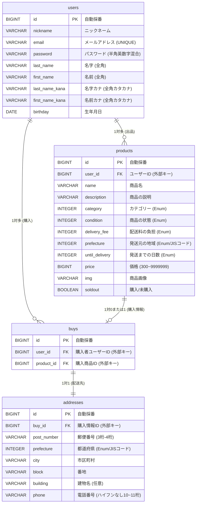

### 📊 ER図（データベース設計）

```mermaid
erDiagram
    users ||--o{ products : "1対多 (出品)"
    users ||--o{ buys : "1対多 (購入)"
    products ||--o| buys : "1対0または1 (購入情報)"
    buys ||--|| addresses : "1対1 (配送先)"

    users {
        BIGINT id PK "自動採番"
        VARCHAR nickname "ニックネーム"
        VARCHAR email "メールアドレス (UNIQUE)"
        VARCHAR password "パスワード (半角英数字混合)"
        VARCHAR last_name "名字 (全角)"
        VARCHAR first_name "名前 (全角)"
        VARCHAR last_name_kana "名字カナ (全角カタカナ)"
        VARCHAR first_name_kana "名前カナ (全角カタカナ)"
        DATE birthday "生年月日"
    }

    products {
        BIGINT id PK "自動採番"
        BIGINT user_id FK "ユーザーID (外部キー)"
        VARCHAR name "商品名"
        VARCHAR description "商品の説明"
        INTEGER category "カテゴリー (Enum)"
        INTEGER condition "商品の状態 (Enum)"
        INTEGER delivery_fee "配送料の負担 (Enum)"
        INTEGER prefecture "発送元の地域 (Enum/JISコード)"
        INTEGER until_delivery "発送までの日数 (Enum)"
        BIGINT price "価格 (300~9999999)"
        VARCHAR img "商品画像"
        BOOLEAN soldout "購入/未購入"
    }

    buys {
        BIGINT id PK "自動採番"
        BIGINT user_id FK "購入者ユーザーID (外部キー)"
        BIGINT product_id FK "購入商品ID (外部キー)"
    }

    addresses {
        BIGINT id PK "自動採番"
        BIGINT buy_id FK "購入情報ID (外部キー)"
        VARCHAR post_number "郵便番号 (3桁-4桁)"
        INTEGER prefecture "都道府県 (Enum/JISコード)"
        VARCHAR city "市区町村"
        VARCHAR block "番地"
        VARCHAR building "建物名 (任意)"
        VARCHAR phone "電話番号 (ハイフンなし10~11桁)"
    }
```
