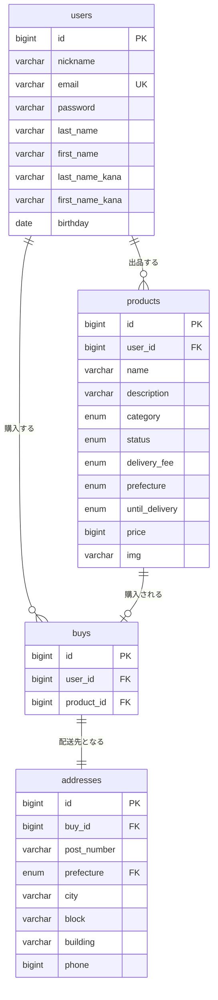

### 📊 ER図（データベース設計）

```mermaid
erDiagram
    users ||--o{ products : "出品する"
    users ||--o{ buys : "購入する"
    products ||--o| buys : "購入される"
    buys ||--|| addresses : "配送先となる"

    users {
        bigint id PK
        varchar nickname
        varchar email UK
        varchar password
        varchar last_name
        varchar first_name
        varchar last_name_kana
        varchar first_name_kana
        date birthday
    }

    products {
        bigint id PK
        bigint user_id FK
        varchar name
        varchar description
        enum category
        enum status
        enum delivery_fee
        enum prefecture
        enum until_delivery
        bigint price
        varchar img
    }

    buys {
        bigint id PK
        bigint user_id FK
        bigint product_id FK
    }

    addresses {
        bigint id PK
        bigint buy_id FK
        varchar post_number
        enum prefecture FK
        varchar city
        varchar block
        varchar building
        bigint phone
    }
```
